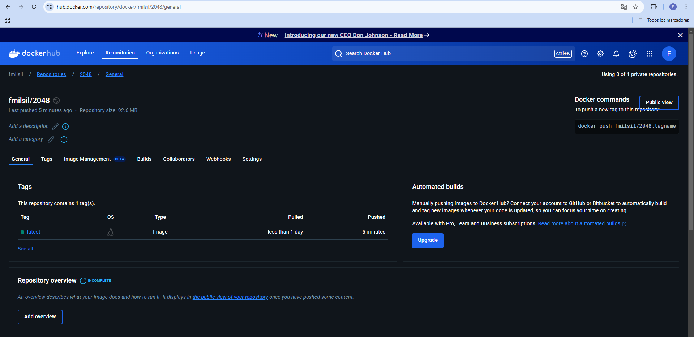
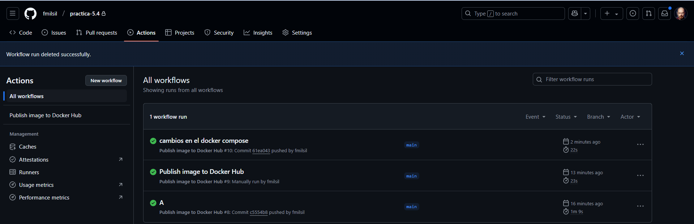
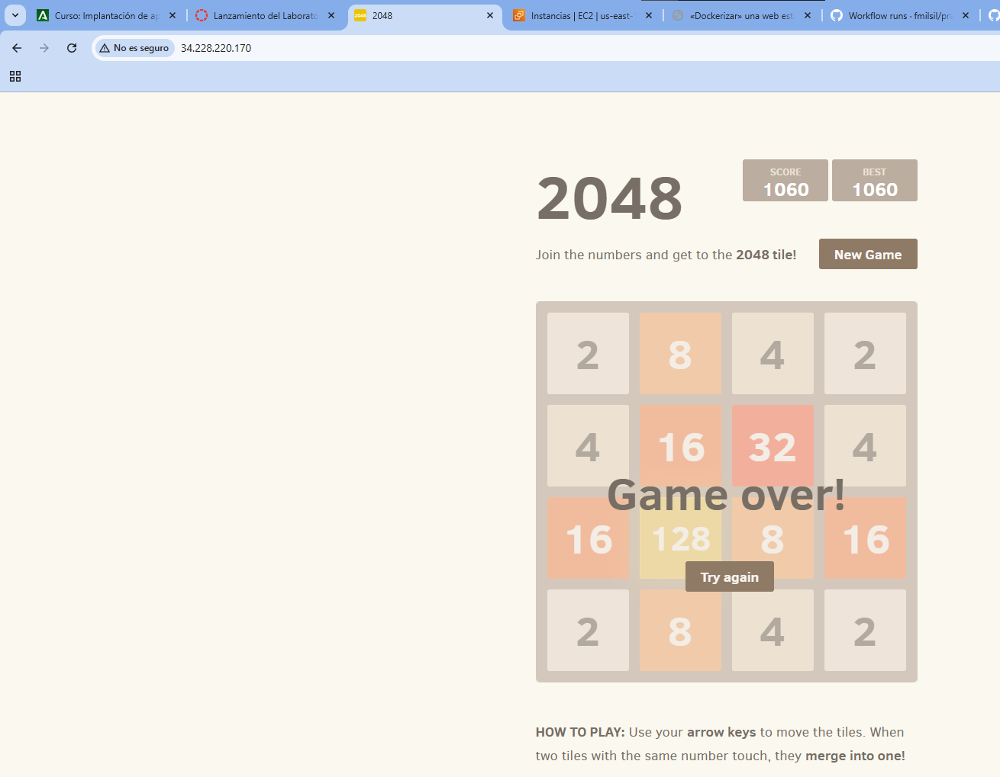

# practica-5.4
En esta práctica vamos a utilizar docker hub junto con varias herramientas de docker como **Dockerfile** y **Docker-Compose**, para la instalación de una página web.

A continuación dejo el contenio de los aechivos utilizados:

### Dockerfile:
```docker
FROM ubuntu:24.04

LABEL AUTHOR="Francisco Milán Siles"
LABEL DESCRIPTION="Prueba de instalación"

ENV WORDPRESS_DB_HOST=mysql


RUN apt update && \
    apt install nginx -y && \
    apt install git -y && \
    rm -rf /var/lib/apt/list/*

RUN git clone https://github.com/josejuansanchez/2048 /app && \
    mv /app/* /var/www/html/

EXPOSE 80

CMD [ "nginx","-g", "daemon off;" ]
```

### docker-compose.yml:
```yml
services:
  web:
    image: fmilsil/2048
    container_name: ipprueba
    ports:
      - 80:80
    restart: always
```

### docker-publish.yml:
```yml
name: Publish image to Docker Hub

# This workflow uses actions that are not certified by GitHub.
# They are provided by a third-party and are governed by
# separate terms of service, privacy policy, and support
# documentation.

on:
  push:
    branches: [ "main" ]
    # Publish semver tags as releases.
    tags: [ 'v*.*.*' ]
  workflow_dispatch:

env:
  # Use docker.io for Docker Hub if empty
  REGISTRY: docker.io
  # github.repository as <account>/<repo>
  #IMAGE_NAME: ${{ github.repository }}
  IMAGE_NAME: 2048
  IMAGE_TAG: latest

jobs:
  build:

    runs-on: ubuntu-latest
    permissions:
      contents: read
      packages: write

    steps:
      - name: Checkout repository
        uses: actions/checkout@v3

      # Set up BuildKit Docker container builder to be able to build
      # multi-platform images and export cache
      # https://github.com/docker/setup-buildx-action
      - name: Set up Docker Buildx
        uses: docker/setup-buildx-action@f95db51fddba0c2d1ec667646a06c2ce06100226 # v3.0.0

      # Login against a Docker registry except on PR
      # https://github.com/docker/login-action
      - name: Log into registry ${{ env.REGISTRY }}
        uses: docker/login-action@343f7c4344506bcbf9b4de18042ae17996df046d # v3.0.0
        with:
          registry: ${{ env.REGISTRY }}
          username: ${{ secrets.DOCKER_USER }}
          password: ${{ secrets.DOCKER_TOKEN }}

      # This action can be used to check the content of the variables
      - name: Debug
        run: |
          echo "github.repository: ${{ github.repository }}"
          echo "env.REGISTRY: ${{ env.REGISTRY }}"
          echo "github.sha: ${{ github.sha }}"
          echo "env.IMAGE_NAME: ${{ env.IMAGE_NAME }}"

      # Build and push Docker image with Buildx (don't push on PR)
      # https://github.com/docker/build-push-action
      - name: Build and push Docker image
        id: build-and-push
        uses: docker/build-push-action@0565240e2d4ab88bba5387d719585280857ece09 # v5.0.0
        with:
          context: .
          push: ${{ github.event_name != 'pull_request' }}
          tags: ${{ env.REGISTRY }}/${{ secrets.DOCKER_USER }}/${{ env.IMAGE_NAME }}:${{ env.IMAGE_TAG }}
          cache-from: type=gha
          cache-to: type=gha,mode=max
```

Ahora voy adjuntar capturas del funcionamiento de los scripts utilizados.

### DockerHub: Subida de la imagen fmilsil/2048


### GitHub: Subida de la imagen hasta DockerHub


### Prueba de la página:

